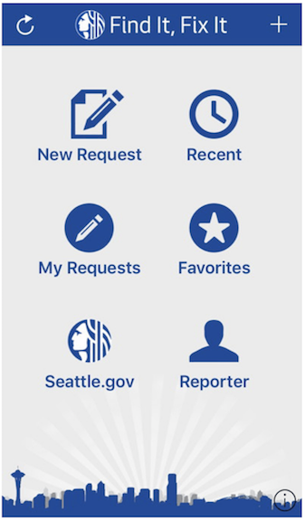

## FIFI Project Summary
Seattle area residents use the 'Find It, Fix It' (FIFI) mobile app to report non-emergency problems to the City, _e.g._ graffiti, broken streetlights, and etc. This project includes: data exploration, statistical analysis, and classification models, using NLP and image classification. A single end-to-end network was trained to predict multiple class labels from a multi-input, mixed data model using TensorFlow and Keras.  

The image classifier model was built upon the pre-trained InceptionV3 model, so lower layer feature extractions correspond to the original 1000 classes which do not necessarily contain our image class labels. The NLP classifier included learned word embeddings, and a recurrent neural network with a bidirectional LSTM layer (nodes ranged from 10-128). To improve training efficiency, the cumbersome RNN model was compared to the fastText classification model with bigrams, as developed by Facebook AI Research. (Joulin _et al._, 2016)  

### Project Objective
To assist the City by training a classification filter based on the image and text data contained in each FIFI request. Using both text and image data is important because the data is very noisy and some of the class categories are difficult to separate due to the overlap between request categories.  

### Background  
Every day, Seattle area residents use the 'Find It, Fix It' (FIFI) mobile app to report problems they want to the City to address, e.g. abandoned vehicles, graffiti, broken streetlights, garbage, and etc. Each report includes metadata, like date and location information, and may also include a text description or an image. Ultimately, the City receives several hundred thousand requests for services every year via the FIFI app. The City would like to incorporate these citizen reports into city planning efforts and ongoing municipal work, so municipal employees spend hours every day, evaluating a fraction of the total requests. However, they do not have the resources to comb through all the image and text data. Moreover, it would be nice to incorporate the data into a dashboard to visualize trends in the data.  

Our goal is to assist the City by providing meaningful classifications based on the image, text, and metadata, so the City can effectively allocate municipal resources. Ideally, the City would like to identify both emergent and systemic problems, assign a priority level to each request, classify the nature of the request for distribution, remove spurious requests, and identify duplicate requests. The classification should be done after a request is submitted via the FIFI app, but does not need to be done in real-time. This automation would free-up employee time, provide greater insights, and allow the requests to be efficiently distributed to the respective municipal agencies for further action. Automating this process will save municipal workers the hours they currently spend manually reviewing these requests.  

Most machine learning models are applied to a single type of data. However, there are several forms of Multimodal Learning models, e.g. multimodal fusion, cross modality learning. Jiquan Ngiam, Aditya Khosla, Mingyu Kim, Juhan Nam, Honglak Lee, and Andrew Y. Ng. Multimodal deep learning. In Proceedings of the 28th International Conference on International Conference on Machine Learning, ICML’11, pages 689–696, USA, 2011. Omnipress.  

Multimodal learning involves relating information from multiple sources. More recently, the OmniNet model is designed to learn multi-modal tasks with multiple input domains and support generic multi-tasking for any set of tasks. [2] While OmniNet does not require a task to be pre-specified, in our application we will limit our tasks to a variety of classification problems. We use a unified multi-modal learning model that incorporates image arrays, vectorized text and metadata as inputs to predict labels in two different multi-classification problems.  

More recently, the OmniNet model is designed to learn multi-modal tasks with multiple input domains and support generic multi-tasking for any set of tasks. [2] While OmniNet does not require a task to be pre-specified, in our application we will limit our tasks to a variety of classification problems.  

### Aims  
In this work, we apply deep networks to learn features over multiple modalities in a real-world application. This project defines and trains a single end-to-end network to predict multiple class labels from a multi-input, mixed data model. Incorporating all available data into the model is important because some classes are ambiguous and many data points include only partial data. goal is to find meaningful representations of mutimodal data so as to capture as much information as possible. To see if a unified model actually provides greater accuracy, we will compare the results to a model where the image classifier is trained separately from the text, and then combined for the final prediction.  

We will initially focus on categorizing the nature of each request and identifying duplicate requests. In future work, we will predict the priority level of each request and add image captioning.  

### About the Data
The data was generated by the FIFI mobile app produced by the City of Seattle's Customer Service Bureau. The data was requested through a public information request form on the [City Public Disclosure site](http://www.seattle.gov/public-records). All reports include text, and most include photos.  

  

### Project Challenges
• Ambiguous Classes: overlapping categories, with imbalanced categorical data  
• Noisy Data: incomplete, incorrectly labeled, and duplicate data  
• Data Volume: Scale of image data (> 50 GB)  

### Project Results
Due to the high degree of ambiguity between classes, some categories performed better than others. For example, the text classifier accurately identifies Graffiti and Garbage category instances, but tends to incorrectly label Abandoned Vehicle and Parking instances. This is understandable since those categories are closely related.  
The fastText model performed slightly worse than the best RNN models. However, fastText only took about 30 minutes to train on 152,820 text samples instead of the 10 hours for the RNN.  
